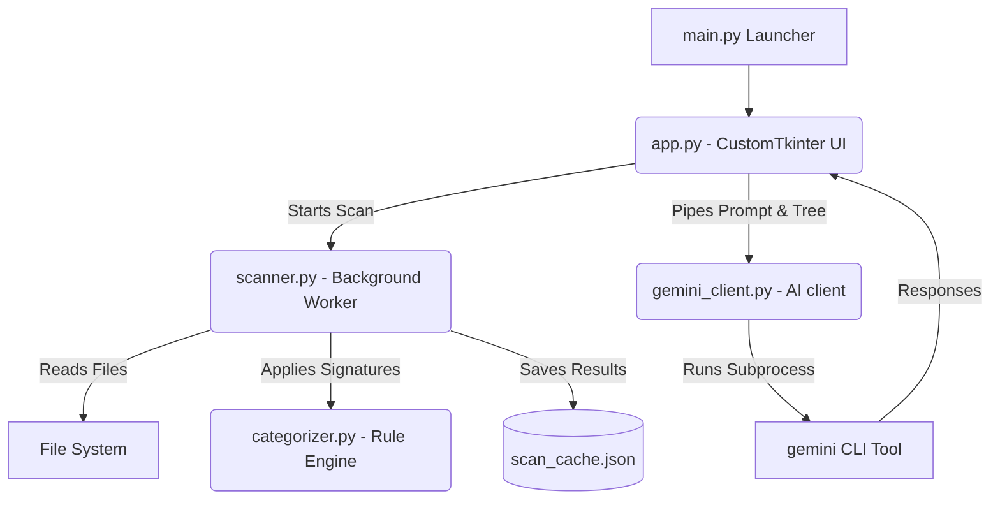

# Disk Companion: Application & Component Overview

**Disk Companion** is a modern, high-performance desktop storage analyzer built with Python. Using a polished dark-mode GUI and an integrated AI chat interface, it provides users with deep insights into their disk space usage, categorizes folders based on structural signatures, and answers natural-language questions about their files.

---

## 📂 Directory Structure & File Manifest

The workspace contains the following core files and directories:

*   **`main.py`**: The application launcher and entrypoint.
*   **`app.py`**: The GUI application layer constructed using CustomTkinter.
*   **`scanner.py`**: A background-threaded directory tree scanner.
*   **`categorizer.py`**: A rule-based signature engine for grouping folders by category.
*   **`gemini_client.py`**: The integration layer connecting the scanned directory structures to the Gemini AI models.
*   **`scan_cache.json`**: A local cache file generated dynamically after scans to allow instant reloads of previously processed folders.
*   **`requirements.txt`**: External Python dependency definitions.
*   **`create_shortcut.ps1`**: A PowerShell utility script that deploys a launch shortcut directly to the Windows Desktop.

---

## 🛠 Component Architecture & Inner Workings

The system is designed with a decoupling of the **User Interface (UI) Thread**, the **File I/O Thread**, and **Subprocess AI Execution**.



### 1. User Interface (`app.py` & `main.py`)
Built using the modern **CustomTkinter** UI framework configured with a harmonized dark color palette.
*   **Header**: Features quick-select shortcut buttons for active system drives (e.g., `C:\`), an interactive file system directory browser, and a rescan trigger.
*   **Folder Tree (Left Panel)**: Uses a custom-themed hierarchical tree showing file sizes and classification badges. Includes real-time character-by-character search filtering and category filters.
*   **Details Panel (Right Panel)**: Displays critical insights for the currently selected folder. It shows subfolder size bars, extension metrics, file/folder counts, and classification reasons.
*   **Ask Gemini (Bottom Panel)**: An interactive conversation box allowing you to ask questions about your storage in plain English.

### 2. File Scanner (`scanner.py`)
To prevent the desktop application from locking up or freezing during heavy file I/O operations, the scanning logic executes entirely on a background thread (`threading.Thread`).
*   Recursively traverses directories to calculate accurate folder sizes.
*   Catalogs file extensions and compiles metadata counts.
*   Saves the final `FolderNode` tree as serialized JSON to `scan_cache.json`. When launching a scan on a previously indexed folder, the app instantly loads it from cache.

### 3. Signature & Categorization Engine (`categorizer.py`)
Rather than running slow AI calls during the active file-scanning phase, folders are categorized using high-performance rules and signatures:
*   **System/App Data**: Folders matching paths such as `Windows`, `ProgramData`, or `AppData`.
*   **Code Projects**: Identified by project markers like `package.json`, `requirements.txt`, `.gitignore`, `cargo.toml`, or if developer extensions (`.py`, `.js`, `.cpp`, etc.) represent the majority.
*   **Games**: Folders inside `Steamapps` or directories containing game archives (`.pak`, `.wad`, `.gcf`).
*   **Media / Documents / Archives**: Classified based on extension densities.

### 4. Gemini AI Chat (`gemini_client.py`)
Integrates natural language analysis:
1.  When a query is entered, `gemini_client.py` compiles a compact hierarchical text representation of the scanned directory tree.
2.  It creates a structured prompt combining a custom system instruction, the directory state representation, and the user's question.
3.  It runs a background subprocess calling the local `gemini` command-line utility.
4.  The response is returned asynchronously to the UI's scrollable chat window.

---

## 🚀 How to Run and Use the Application

### 1. Launching the App
Ensure python dependencies are configured, then launch the project:
```powershell
python main.py
```
*(Alternatively, you can right-click and run `create_shortcut.ps1` in PowerShell to generate an interactive desktop shortcut.)*

### 2. Operational Guide
1.  **Select a Folder/Drive**: Click on any of the quick-access drive buttons (e.g., `C:\`) or click the directory browser button in the header.
2.  **Browse the Tree**: Click on folders in the treeview on the left to expand them.
3.  **View Insights**: Selecting a folder instantly updates the details panel on the right with a breakdown of its largest subfolders and most common file types.
4.  **Query the AI**: Type a question in the bottom text box. For example:
    *   *"Which folder in this directory is taking up the most space?"*
    *   *"What kind of files are under my scanned directories?"*
    *   *"Are there any game files or code projects taking up too much room?"*
